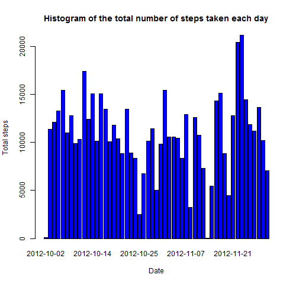
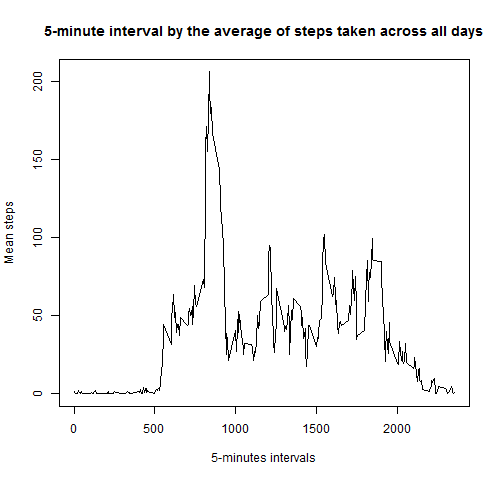
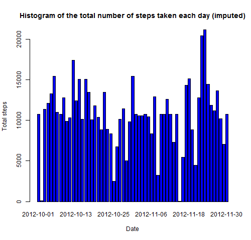
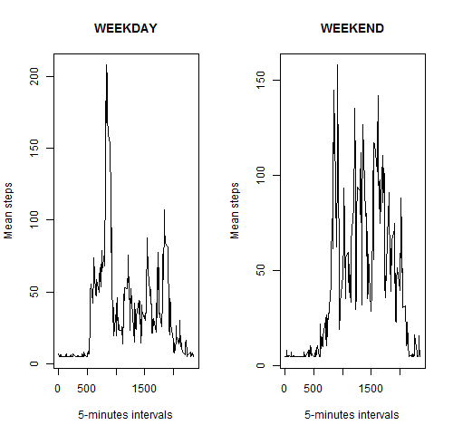

STEP 1: I LOAD PACKAGES AND DATASET

```r
library(lubridate)
library(lattice)
library(graphics)
setwd ("C:/Users/ealonso/Desktop/Coursera R/Reproductible research/Proyecto 1/")
base <- read.csv("activity.csv", header=TRUE, sep=",", dec=".")
```

Then, I set the class of date to [1] "POSIXct" "POSIXt" 

```r
base$date <- ymd(base$date)
```


STEP 2: WHAT IS MEAN TOTAL NUMBER OF STEPS TAKEN PER DAY?
Firstly, I calculate the total number of steps taken per day. 

```r
total_steps_perday <- aggregate(steps ~ date, base, FUN=sum, na.rm=TRUE)
head(total_steps_perday)
```

```
##         date steps
## 1 2012-10-02   126
## 2 2012-10-03 11352
## 3 2012-10-04 12116
## 4 2012-10-05 13294
## 5 2012-10-06 15420
## 6 2012-10-07 11015
```

Secondly, I make a histogram of the total number of steps taken each day. 

```r
barplot(total_steps_perday$steps, names.arg=total_steps_perday$date, col="blue", main="Histogram of the total number of steps taken each day", xlab="Date", ylab="Total steps")
```

 

Thirdly, I calculate and report the mean and median of the total number of steps taken per day

```r
mean_steps <- mean(total_steps_perday$steps)
median_steps <- median(total_steps_perday$steps)
report1 <- cbind(mean_steps, median_steps) 
colnames(report1) <- c("Mean","Median")
print(report1)
```

```
##          Mean Median
## [1,] 10766.19  10765
```


STEP 3: WHAT IS THE AVERAGE DAILY ACTIVITY PATTERN?
First, I calculate the average number of steps taken per day. 

```r
mean_steps_perday <- aggregate(steps ~ interval, base, FUN=mean, na.rm=TRUE)
```

Second, I make a time series plot of the 5-minute interval (x-axis) and the average number of steps taken, averaged across all days (y-axis).

```r
plot(mean_steps_perday$interval,mean_steps_perday$steps,type="l",main="5-minute interval by the average of steps taken across all days",xlab="5-minutes intervals", ylab="Mean steps")
```

 

Thrid, Which 5-minute interval, on average across all the days in the dataset, contains the maximum number of steps?

```r
maximum <- mean_steps_perday$interval[which.max(mean_steps_perday$steps)]
print(maximum)
```

```
## [1] 835
```


STEP 4: IMPUTING MISSING VALUES
First, I calculate and report the total number of missing values in the dataset. 

```r
summary(base)
```

```
##      steps             date               interval     
##  Min.   :  0.00   Min.   :2012-10-01   Min.   :   0.0  
##  1st Qu.:  0.00   1st Qu.:2012-10-16   1st Qu.: 588.8  
##  Median :  0.00   Median :2012-10-31   Median :1177.5  
##  Mean   : 37.38   Mean   :2012-10-31   Mean   :1177.5  
##  3rd Qu.: 12.00   3rd Qu.:2012-11-15   3rd Qu.:1766.2  
##  Max.   :806.00   Max.   :2012-11-30   Max.   :2355.0  
##  NA's   :2304
```

The output shows that in "steps variable" are 2304 NA's values. Second, I impute the mean to the missing values. 

```r
for (i in 1:length(base$steps)) {
  if (is.na(base$steps[[i]])==TRUE){base$steps[[i]]<-mean(base$steps,na.rm = TRUE)}
}
```

Thrid, I apply the first step to check differences between both data sets

```r
total_steps_perday2 <- aggregate(steps ~ date, base, FUN=sum, na.rm=TRUE)
head(total_steps_perday2)
```

```
##         date    steps
## 1 2012-10-01 10766.19
## 2 2012-10-02   126.00
## 3 2012-10-03 11352.00
## 4 2012-10-04 12116.00
## 5 2012-10-05 13294.00
## 6 2012-10-06 15420.00
```

```r
barplot(total_steps_perday2$steps, names.arg=total_steps_perday2$date, col="blue", main="Histogram of the total number of steps taken each day (imputed)", xlab="Date", ylab="Total steps")
```

 

```r
mean_steps2 <- mean(total_steps_perday2$steps)
median_steps2 <- median(total_steps_perday2$steps)
report2 <- cbind(mean_steps2, median_steps2) 
colnames(report2) <- c("Mean (imputed)","Median (imputed)")
print(report2)
```

```
##      Mean (imputed) Median (imputed)
## [1,]       10766.19         10766.19
```

The mean doesn't differ from data set with NA's values, this is because I have imputed the mean. The median is little higher in data set where NA's was removed.


STEP 5: ARE THERE DIFFERENCES IN ACTIVITY PATTERNS BETWEEN WEEKDAYS AND WEEKENDS?
First, I Create a new factor variable in the dataset with two levels - "weekday" and "weekend" indicating whether a given date is a weekday or weekend day. 

```r
base$type_day <- weekdays(base$date)
for (i in 1:length(base$steps)) {  
  if ((base$type_day[[i]]=="sábado" | base$type_day[[i]]=="domingo")){
    base$type_day[i] <- "weekend"
  }else{
    base$type_day[i] <- "weekday"
  }
}
```

Second, I make a panel plot containing a time series plot of the 5-minute interval and the average number of steps taken, averaged across all weekday days or weekend days.

```r
mean_steps_perday2 <- aggregate(steps ~ interval+type_day, base, FUN=mean)
set1 <- subset(mean_steps_perday2,type_day=="weekday")
set2 <- subset(mean_steps_perday2,type_day=="weekend")
par(mfrow=c(1,2))
plot(set1$interval,set1$steps,type="l",main="WEEKDAY",xlab="5-minutes intervals", ylab="Mean steps")
plot(set2$interval,set2$steps,type="l",main="WEEKEND",xlab="5-minutes intervals", ylab="Mean steps")
```

 

